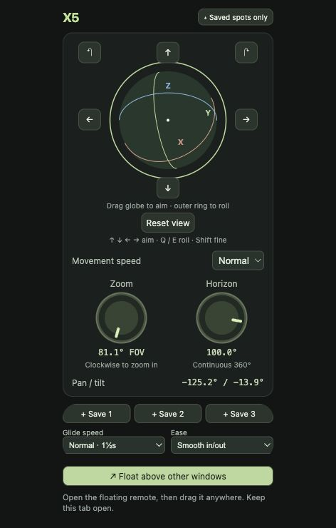

# X5 View Remote

A tiny local remote that turns an Insta360 X5's stitched 360° webcam feed into a steerable camera view in OBS. Drag the trackball, adjust zoom, or glide between three named shots. Collapse it to saved spots and float it above your other windows.

<p align="center">
  
</p>

No npm dependencies, cloud services, or API keys. This repo contains the frontend, local OBS bridge, shader, setup utility, and tests—not the OBS plugin itself.

## Requirements

- Node.js 22 or newer.
- OBS Studio with its WebSocket server enabled (Tools → WebSocket Server Settings). Keep authentication enabled.
- **[Exeldro's obs-shaderfilter plugin](https://github.com/exeldro/obs-shaderfilter)**. Download the appropriate installer from its [releases](https://github.com/exeldro/obs-shaderfilter/releases), install, and restart OBS. The required effect filter is **User-defined shader** (`shader_filter`).
- Insta360 X5 connected over USB in Webcam mode, already added as a Video Capture Device in OBS.
- Chrome or Edge for the always-on-top Document Picture-in-Picture remote. The ordinary page also works without PiP.

**Current scope:** developed on macOS with OBS 32.2.2 and obs-shaderfilter 2.6.0. The bridge reads the existing macOS OBS WebSocket config; automatic capture setup and health checks are macOS-specific. Windows/Linux are not currently supported by these scripts without adapting configuration paths and capture properties.

## Quick start

From this folder:

```sh
node --version
npm test
npm run setup -- --source "Video Capture Device"
```

The last command only inspects OBS and prints a plan. Use the exact source name shown in your OBS Sources list. If omitted, setup tries to find exactly one X5 source.

Apply the reviewed plan, then start the remote:

```sh
npm run setup -- --source "Video Capture Device" --apply
npm start
```

Open **http://127.0.0.1:4785/**. No `npm install` is necessary. Keep OBS and the server running. Ctrl-C stops the server.

If port 4785 is already in use by an earlier copy of this controller, stop that copy first. Keeping the same browser and origin preserves its locally saved spots and preferences.

## Camera mode matters

In the camera source's Properties, disable **Use Preset** and select **2880×1440 at 30 FPS**. This selects the camera's stitched 2:1 panorama. A High preset can instead produce a split-screen view which this shader cannot interpret. Recheck the mode and selected device after unplugging/replugging.

This follows [Insta360's X5 OBS instructions](https://onlinemanual.insta360.com/x5/en-us/camera/appuse/obs). The shader does **not** stitch raw fisheye lenses; it projects the already-stitched panorama into a rectilinear view. No automatic leveling is applied.

## What setup changes—and does not

`scripts/setup.mjs` connects to the local OBS WebSocket server using the existing password without printing it. It verifies the selected camera is available, the plugin is installed, and a matching capture format is advertised.

With `--apply`, it writes a private, git-ignored snapshot under `backups/`, changes only the selected source's capture-mode fields, attaches the shader via its absolute path, and enables that filter. It reuses an existing X5 shader filter and preserves its rotation/zoom settings. Unrelated filters and scene layouts are left alone. It does not install software, enable WebSocket, create camera sources, start streaming/recording, or grant permissions.

If a request fails midway, earlier changes may already have applied; inspect OBS and the printed backup. Backups record the original input settings and filters for manual recovery; there is no automatic rollback command. To undo a new attachment, remove only **X5 View** from that source's Filters and restore its capture settings. To undo an update, restore the previous shader path/settings from the backup.

If setup cannot enumerate formats, manually disable Use Preset and choose the required format, then rerun. If you move this repo later, rerun setup to update the absolute shader path. Check the OBS preview after setup: setting readback cannot prove shader compilation or correct visual output.

## Manual shader installation

1. Right-click the X5 source → Filters → Effect Filters → **User-defined shader**.
2. Enable **Load shader text from file**. Leave **Use Effect File (.effect)** unchecked.
3. Browse to `shaders/insta360-x5-flat-view.shader` in this repo.
4. Click **Reload effect** after editing the shader.
5. Run `npm start` and open the controller.

The remote discovers the filter by this filename. Use one matching source/filter to avoid ambiguity. Webcam and desktop sources can be composed separately in OBS; this remote changes only the X5 view.

## Controls

| Control | Action |
| --- | --- |
| Globe drag | Rotate relative to the current camera view |
| Outer ring / roll knob | Roll around the viewing axis |
| Arrow buttons / keyboard arrows | Aim; hold for repeated movement |
| Q / E | Roll left / right |
| Shift | Fine movement |
| Zoom knob / + / − | Adjust field of view, bounded to 10–130° |
| Reset view | Return to the view captured when the page connected |
| Empty saved spot | Save current framing |
| Saved spot click | Glide to that framing |
| Hold a spot / right-click / Shift-click | Rename or replace with current view |
| Saved spots only / Expand | Collapse or restore controls |

Glide duration: Cut, ½s, 1½s, 3s, or 5s. Easing: Linear, Smooth in/out, or Ease out. Rotation follows shortest-path quaternion interpolation, with zoom interpolated alongside it. Manual movement interrupts a glide. Glide/ease settings are hidden in compact mode but still apply.

Presets and preferences live in browser localStorage, not OBS or Git. Different browsers/profiles have different spots. Clearing site data deletes them. Keep one active remote to avoid competing updates.

Click **Float above other windows** to open PiP, then collapse it for a small shot-switcher. Keep the originating tab open. Browser/OS minimum window sizes may limit how small it can become. Keyboard shortcuts require focus in the remote; they are not global OBS hotkeys.

The **X5** label is green when device availability, configured capture mode, and enabled filter checks pass; red means attention is needed. Click it for details. It polls every three seconds. It does not verify frame freshness, image quality, or successful shader compilation.

## Architecture and security

```text
Browser remote → local Node bridge → OBS WebSocket → shader filter → OBS output
```

The trackball composes quaternions, converting to the shader's yaw/pitch/roll transport format. The shader samples the panorama with longitude wrapping. It preserves the source dimensions; arrange/crop the result in OBS as desired.

The HTTP bridge binds only to `127.0.0.1:4785`, checks Host/Origin, and accepts numeric view fields only. The OBS password remains server-side, read from `~/Library/Application Support/obs-studio/plugin_config/obs-websocket/config.json`. Never commit that file, OBS credentials, or private scene backups. Do not expose this server publicly; it has no user-login layer. A local screenshot endpoint is retained but the frontend does not request preview frames.

## Layout and development

```text
controller/index.html       UI, trackball, presets, glides, PiP
controller/server.mjs       Loopback HTTP API
lib/obs.mjs                 Authenticated OBS WebSocket client
shaders/insta360-x5-flat-view.shader
scripts/setup.mjs           Dry-run / apply setup
test/controller.test.mjs    Rotation and frontend syntax tests
```

Run `npm test`. Tests cover quaternion/Euler round trips including poles, shortest-path glide wrap, knob wrap, and JavaScript syntax. Live OBS setup, disconnect/reconnect, PiP sizing, and visual output still need integration checks on the target machine.

## Credits

Requires the separately installed [obs-shaderfilter](https://github.com/exeldro/obs-shaderfilter) by Exeldro and contributors, plus OBS Studio. Not an official Insta360 or OBS product. The plugin's source and binaries are not bundled here.
